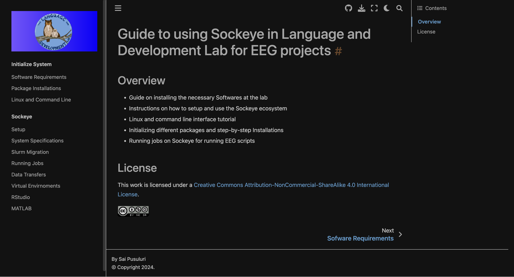

# Sockeye-Guide-langdevlab
Welcome to the Sockeye EEG Project Guide for the Language and Development Lab. This comprehensive manual provides you with all the necessary information to get started with EEG projects using the Sockeye supercomputing environment by the Advanced Research Computing Institute at UBC.

